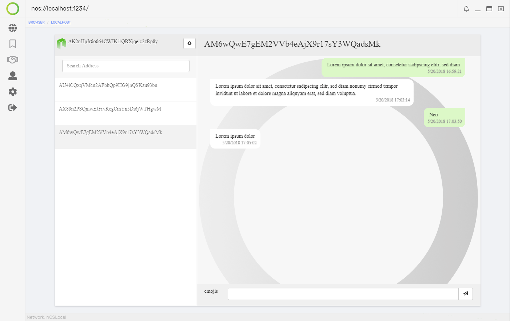

<p align="center">
   
</p>

<h1 align="center">Neochat</h1>

<p align="center">
  Secure and fully decentralized messaging <strong>dApp</strong> on the <strong>nOS</strong> platform.
</p>

## Purpose
Todays messenger like Whatsapp offer great functionality and high comfort. In addition end-to-end encryption promise high security and privacy. 

But how can you trust companies, that make money based on user preferences and interests? In addition these messengers are closed source. How can you verify, that no master key exists to expose your private messages? How can you prevent these companies from reading your contacts and constructing complex user profiles? 

One answer is you can't. These business models and advertising platforms are unlikely to be changed in the near future.

The other answer is to use a platform where trust is given at any time through blockchain technology and open source applications.

#### Neochat provides a fully decentralized, trustless and open source messenger based on nOS and the NEO blockchain.

## Features
* 100% decentralized messenger
* Send and receive messages (based on NEO addresses) for free
* Register your account to enable encryption of messages *1

### Features to be activated in the next versions:
* End-to-end encryption
* Attaching tokens/assets to messages
* Emoji support
* Media support with IPFS

*1 Encryption to be implemented as soon as the nOS client activates that functionality.

## Setup
```bash
$ git clone https://github.com/kokahunter/neochat-local.git
$ cd neochat-local
$ yarn install & yarn start
```

#### Smart contract
`copy` https://github.com/kokahunter/neochat-local/blob/master/smartcontract/neochat/neochat_v2.avm into the `smart-contracts` folder of neo-python

`import contract /smart-contracts/neochat_v2.avm 0710 05 True False`